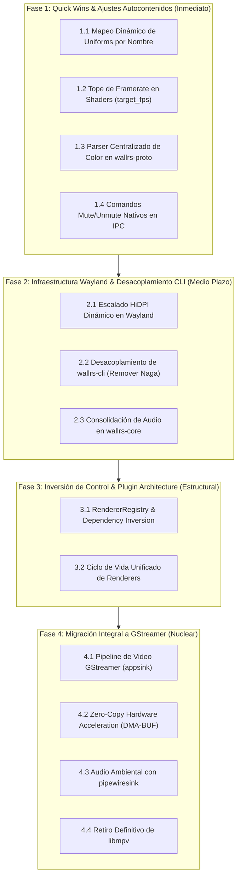

# Milestone 1.2 Roadmap: Architectural Refactoring & GStreamer Migration

## Executive Summary

Version 1.1 established `wallrs` as a feature-complete, production-ready Wayland live wallpaper suite with multi-output support, interactive pointer parallax, day/night cycles, audio reactivity, and native scaffolding.

**Milestone 1.2** defines the subsequent evolution of the codebase. To maximize momentum and guarantee stability, the roadmap is strictly **prioritized by feasibility and self-containment**: small, isolated, high-impact improvements are executed and tuned first, deferring heavy architectural migrations (such as GStreamer and zero-copy DMA-BUF) to dedicated phases.

---

## Metodología de Priorización: Viabilidad y Autocontención



---

## 🎯 Fase 1: Quick Wins & Ajustes Autocontenidos (Alta Viabilidad / Mínimo Riesgo)

> [!TIP]
> **Criterio**: Tareas pequeñas que no rompen dependencias cruzadas, no afectan al resto del roadmap y pueden implementarse, probarse y afinarse de inmediato de forma 100% aislada.

### 1.1 Mapeo Dinámico de Uniforms Personalizados por Nombre
* **Crate**: `wallrs-content-shader`
* **Autocontención**: Alta (confinado exclusivamente a la memoria WGSL y al mapa de propiedades de `ShaderRenderer`).
* **Objetivo**:
  * Actualmente, los shaders solo leen tres variables fijas: `"custom0"`, `"custom1"`, `"custom2"`.
  * Implementar un descriptor de uniforms que permita a los autores nombrar propiedades libremente en su `wallpaper.toml` (ej. `speed = 1.5`, `glow = 0.8`) e inyectarlas dinámicamente en los slots o mediante offsets uniformes.
* **Entregables**:
  - Mapeo declarativo de hasta 8 floats personalizados en `ShaderUniforms`.
  - Soporte para `wallctl set-property <nombre> <valor>` sin requerir nombres `customN`.

### 1.2 Tope de Framerate Configurable en Shaders (`target_fps`)
* **Crates**: `wallrs-proto`, `wallrs-content-shader`
* **Autocontención**: Alta (sigue exactamente el patrón ya probado en `wallrs-content-image`).
* **Objetivo**:
  * Extender `ShaderConfig` en `wallrs-proto` con `pub fps: Option<u32>`.
  * Implementar `target_fps(&self) -> Option<f64>` en `ShaderRenderer` (tope de 60 FPS por omisión para shaders procedurales intensivos).
  * Evita el desperdicio térmico y energético en pantallas gaming de 144Hz–240Hz.

### 1.3 Unificación del Parser de Colores Hex/RGBA
* **Crate**: `wallrs-proto` (y consumo en `wallrs-cli`, `wallrs-daemon`, `wallrs-content-image`)
* **Autocontención**: Alta (sustituye 3 implementaciones divergentes por una única función centralizada).
* **Objetivo**:
  * Consolidar `parse_hex_color` y `parse_color` en una función canónica en `wallrs-proto`:
    `pub fn parse_color(s: &str) -> Result<[f32; 4], ParseColorError>`
  * Soporte unificado para `#RGB`, `#RGBA`, `#RRGGBB`, `#RRGGBBAA` y floats `r,g,b,a`.

### 1.4 Refinamiento del Protocolo IPC: Comandos Dedicados `Mute` / `Unmute`
* **Crates**: `wallrs-proto`, `wallrs-core`, `wallrs-cli`
* **Autocontención**: Alta (amplía el enum `Command` sin romper compatibilidad existente).
* **Objetivo**:
  * Agregar variantes explícitas `Command::Mute { output: OutputSelector }` y `Command::Unmute { output: OutputSelector }`.
  * Agregar flag `unmute: bool` en `Command::SetWallpaper` para aplicar fondo y desmutear en una única operación atómica por socket, eliminando el segundo viaje de red de `wallctl`.

---

## 🚀 Fase 2: Infraestructura Wayland & Desacoplamiento CLI (Media Viabilidad)

> [!NOTE]
> **Criterio**: Mejoras directas al servidor de despliegue y empaquetado que no requieren modificar el motor de renderizado de medios.

### 2.1 Escalado HiDPI Dinámico en Wayland
* **Crate**: `wallrs-core`
* **Autocontención**: Media (afecta a `EngineState` y a la configuración de superficies WGPU).
* **Objetivo**:
  * Implementar el callback `CompositorHandler::scale_factor_changed`.
  * Manejar `wl_surface::preferred_buffer_scale` para pantallas 4K con escalado fraccional o entero (ej. 1.5x o 2x en KDE/Hyprland).
  * Reconfigurar automáticamente el tamaño físico del swapchain WGPU:
    $$\text{Physical Size} = \text{Logical Size} \times \text{Scale Factor}$$

### 2.2 Desacoplamiento de `wallrs-cli` (Extracción del Compilador Naga)
* **Crate**: `wallrs-cli`
* **Autocontención**: Media.
* **Objetivo**:
  * Remover las dependencias directas de `wallrs-content-shader` y `naga` de `wallrs-cli/Cargo.toml`.
  * Reducir drásticamente el tamaño del binario `wallctl` y su tiempo de compilación.
  * Delegar la validación sintáctica pesada de shaders al daemon en ejecución vía IPC, o aislarla en un subcrate ligero opcional.

### 2.3 Consolidación del Subsistema de Audio en `wallrs-core`
* **Crate**: `wallrs-core`
* **Autocontención**: Media.
* **Objetivo**:
  * Unificar la gestión de mute, volumen y sincronización de PipeWire en una sola estructura `AudioController`.
  * Eliminar la duplicación de llamadas `set_property("mute")` entre el renderer y la pista de fondo.

---

## 🏗️ Fase 3: Refactor Estructural e Inversión de Control (Alta Complejidad)

> [!IMPORTANT]
> **Criterio**: Preparación del núcleo para soportar plugins dinámicos o compilación modular sin acoplamiento duro.

### 3.1 Arquitectura de Plugins & Fábrica Dinámica (`RendererRegistry`)
* **Crates**: `wallrs-render`, `wallrs-core`, `wallrs-daemon`
* **Objetivo**:
  * Eliminar el `match manifest.wallpaper.r#type.as_str()` hardcodeado en `wallrs-core/src/ipc.rs`.
  * Implementar el patrón Inversión de Dependencias (DIP):
    ```rust
    pub trait RendererFactory: Send + Sync {
        fn create_renderer(&self, manifest: &WallpaperManifest, base_dir: &Path) 
            -> Result<Box<dyn WallpaperRenderer>, RendererError>;
        fn supports_type(&self, type_name: &str) -> bool;
    }
    ```
  * `wallrs-core` no dependerá de `wallrs-content-image`, `wallrs-content-shader` ni `wallrs-content-video`. La aplicación principal (`wallrsd`) inyecta los plugins registrados durante el arranque.

---

## 🎥 Fase 4: Migración Integral a GStreamer (Nuclear / Foco Pesado)

> [!CAUTION]
> **Criterio**: Cambio del motor multimedia. Requiere pruebas extensivas en hardware diverso (Intel VA-API, AMD RADV, NVIDIA NVDEC, CPU fallback) y actualización de empaquetado en distribuciones Linux.

### 4.1 Pipeline Base de Video con GStreamer (`appsink`)
* **Crate**: `wallrs-content-video`
* **Implementación**:
  * Construcción de pipeline con GStreamer Rust bindings (`gstreamer`, `gstreamer-app`, `gstreamer-video`).
  * Conexión a `appsink` para recepción de buffers de video en formato `video/x-raw`.
  * Loop fluido sin micro-cortes utilizando `GstSegment` y `seek` cíclico.

### 4.2 Zero-Copy Hardware Acceleration (DMA-BUF & Vulkan Import)
* **Crate**: `wallrs-content-video`
* **Implementación**:
  * Aprovechar decodificadores por hardware (`vaapih264dec`, `vaapivp9dec` o extensiones Vulkan Video).
  * Negociar buffers de memoria DMA-BUF (`GstMemory` / `dmabuf`) compartidos directamente con texturas de WGPU/Vulkan.
  * **Eliminación total del buffer intermedio de copia en CPU (`cpu_buffer: Vec<u8>`)**, reduciendo el ancho de banda PCIe y el consumo de energía en reproducción 4K hasta en un 70%.

### 4.3 Pipeline de Audio Ambiental con `pipewiresink`
* **Crate**: `wallrs-audio`
* **Implementación**:
  * Reemplazo de `BackgroundAudioPlayer` con un pipeline GStreamer exclusivo de audio (`playbin3 video-sink=fakesink audio-sink=pipewiresink`).
  * Integración nativa con PipeWire sin colisiones de hilos de audio independientes.

### 4.4 Retiro Definitivo y Limpieza de `libmpv`
* **Archivos**: `Cargo.toml`, `extra/arch/PKGBUILD`, `extra/rpm/wallrs.spec`, `crates/wallrs-daemon/Cargo.toml`
* **Implementación**:
  * Desvincular `libmpv2` y `libmpv2-sys`.
  * Actualizar paquetes del sistema: reemplazar dependencia `libmpv` por `gstreamer1.0-plugins-base` y `gstreamer1.0-plugins-good`.
  * Limpieza de banderas de compilación y CI.

---

## 📊 Matriz de Prioridad, Viabilidad y Autocontención

|  Fase   | Tarea                        |   Viabilidad    |      Autocontención      |  Impacto en Usuario   | Riesgo de Regresión |
| :-----: | :--------------------------- | :-------------: | :----------------------: | :-------------------: | :-----------------: |
| **1.1** | Mapeo de uniforms por nombre |   🟢 Muy Alta    | 🟢 Alta (local en shader) |      🟢 Inmediato      |       🟢 Nulo        |
| **1.2** | FPS ceiling para shaders     |   🟢 Muy Alta    | 🟢 Alta (proto + shader)  |     🟢 Ahorro GPU      |       🟢 Nulo        |
| **1.3** | Parser unificado de color    |   🟢 Muy Alta    |  🟢 Alta (utilidad pura)  |    🟡 Consistencia     |       🟢 Nulo        |
| **1.4** | Mute/Unmute nativo en IPC    |   🟢 Muy Alta    |    🟢 Alta (protocolo)    |   🟢 Menor latencia    |       🟢 Nulo        |
| **2.1** | Wayland HiDPI Scaling        |     🟡 Media     |   🟡 Media (motor WGPU)   |   🟢 Calidad visual    |       🟡 Bajo        |
| **2.2** | Desacoplamiento de CLI       |     🟡 Media     |  🟡 Media (dependencias)  |   🟡 Binario ligero    |       🟢 Nulo        |
| **2.3** | Consolidación de Audio       |     🟡 Media     |      🟡 Media (core)      |   🟡 Mantenibilidad    |       🟡 Bajo        |
| **3.1** | Registry de Plugins (DIP)    |     🟡 Media     |   🔴 Estructural (core)   | 🟢 Arquitectura limpia |       🟡 Medio       |
| **4.1** | GStreamer appsink básico     |     🟡 Media     |     🟡 Local en video     |  🟢 Estabilidad Linux  |       🟡 Medio       |
| **4.2** | Zero-Copy DMA-BUF            | 🔴 Baja/Compleja |  🔴 Requiere HW testing   |  🟢 Máxima eficiencia  |  🔴 Alto (drivers)   |
| **4.3** | GStreamer Ambient Audio      |     🟢 Alta      |     🟢 Local en audio     |   🟢 PipeWire nativo   |       🟡 Bajo        |
| **4.4** | Remoción total de libmpv     |     🟢 Alta      |      🟡 Empaquetado       |    🟢 Portabilidad     |       🟡 Bajo        |
