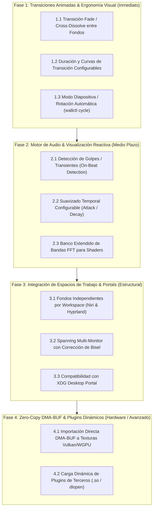

# Milestone 1.3 Roadmap: Advanced Transitions, Wayland Workspaces & Zero-Copy DMA-BUF

## Executive Summary

Version 1.2 completed the monumental transition to **GStreamer**, established the **Plugin Factory Registry (`RendererRegistry`)**, resolved Wayland HiDPI scaling, introduced native Niri & Noctalia desktop theming integration, and hardened daemon lifecycle and teardown.

**Milestone 1.3** focuses on elevating `wallrs` to a best-in-class user experience, bringing smooth visual transitions between wallpapers, deeper compositor integration (per-workspace wallpapers in Niri and Hyprland, panoramic spanning), enhanced audio reactivity, and pushing video performance to hardware limits with true GPU-to-GPU DMA-BUF zero-copy pipelines.

---

## Metodología de Priorización: Viabilidad y Autocontención

---

## 🎯 Fase 1: Transiciones Animadas & Ergonomía Visual

> [!TIP]
> **Criterio**: Mejoras directas de presentación visual que no alteran la arquitectura del motor y aportan un salto evidente en la calidad percibida del usuario.

### 1.1 Transición Fade / Cross-Dissolve entre Fondos
* **Crates**: `wallrs-core`, `wallrs-render`
* **Autocontención**: Alta.
* **Objetivo**:
  * Actualmente, cambiar de wallpaper reemplaza instantáneamente la superficie del renderer activo.
  * Implementar una etapa de transición intermedia donde el fondo saliente y el entrante se mezclan mediante un shader de composición (`alpha_blend = mix(src, dst, progress)`).
* **Entregables**:
  - Transición fluida `cross-dissolve` al invocar `wallctl set`.
  - Manejo seguro de memoria para no retener buffers del fondo anterior tras finalizar la transición.

### 1.2 Duración y Curvas de Transición Configurables
* **Crates**: `wallrs-proto`, `wallrs-core`, `wallrs-cli`
* **Autocontención**: Alta.
* **Objetivo**:
  * Parámetro opcional `--transition-duration <ms>` en `wallctl set` (por omisión 300ms–500ms, o `0` para cambio inmediato).
  * Opciones de curvas de interpolación: `linear`, `ease-in-out`, `cubic`.

### 1.3 Modo Rotación Automática / Diapositivas (`wallctl cycle`)
* **Crates**: `wallrs-cli`, `contrib/`
* **Autocontención**: Alta (herramienta de usuario o timer en el daemon).
* **Objetivo**:
  * Comando para ciclar periódicamente los wallpapers contenidos en una carpeta con un intervalo definido (ej. cada 15 o 30 minutos).

---

## 🎵 Fase 2: Motor de Audio & Visualización Reactiva

> [!NOTE]
> **Criterio**: Refinamiento del subsistema de análisis de audio de PipeWire para elevar la fidelidad de los shaders reactivos.

### 2.1 Detección de Golpes / Transientes (On-Beat Detection)
* **Crate**: `wallrs-audio`
* **Autocontención**: Media (dentro del analizador espectral FFT).
* **Objetivo**:
  * Algoritmo de detección de transientes de energía en frecuencias graves (sub-bass / kick).
  * Inyección del flag `beat` o factor de pulso en los uniforms del shader (`ShaderUniforms::beat_pulse`), permitiendo efectos de pulsación rítmica precisos.

### 2.2 Suavizado Temporal Configurable (Attack / Decay)
* **Crate**: `wallrs-audio`
* **Autocontención**: Alta.
* **Objetivo**:
  * Filtrado temporal IIR de los bins de frecuencia para evitar saltos bruscos o ruido en pasajes musicales suaves.
  * Parámetros ajustables de ataque rápido (subida instantánea ante transientes) y caída suave (*decay* exponencial).

### 2.3 Banco Extendido de Bandas FFT para Shaders
* **Crates**: `wallrs-proto`, `wallrs-content-shader`
* **Autocontención**: Media.
* **Objetivo**:
  * Ampliar la resolución de bandas espectrales pasadas al pipeline WGSL (de 16 a 32 o 64 bins normalizados en escala Bark/Mel logarítmica).

---

## 🖥️ Fase 3: Integración de Espacios de Trabajo & Portals

> [!IMPORTANT]
> **Criterio**: Profundización en las capacidades nativas de Wayland y los compositores modernos basados en wlr / layer-shell.

### 3.1 Fondos Independientes por Workspace (Niri & Hyprland)
* **Crates**: `wallrs-core`, `contrib/`
* **Autocontención**: Media.
* **Objetivo**:
  * Asociar fondos distintos según el espacio de trabajo activo o enfocado.
  * En Niri: escuchar eventos de cambio de workspace mediante `niri msg --json event-stream` y alternar dinámicamente con transiciones fluidas.
  * En Hyprland: escuchar eventos de workspace vía el socket IPC de Hyprland.

### 3.2 Spanning Panorámico Multi-Monitor con Biseles
* **Crate**: `wallrs-core`
* **Autocontención**: Media.
* **Objetivo**:
  * Extender un fondo ultra-panorámico (ej. 3840x1080 o 7680x1440) a través de múltiples salidas con mapeo de coordenadas UV normalizadas y compensación de marcos físicos (*bezel correction*).

### 3.3 Soporte XDG Desktop Portal
* **Crate**: `wallrs-daemon`
* **Autocontención**: Media/Baja.
* **Objetivo**:
  * Implementar o responder a llamadas del portal de selección de fondo para integración nativa con interfaces gráficas estándar.

---

## ⚡ Fase 4: Zero-Copy DMA-BUF & Plugins Dinámicos

> [!CAUTION]
> **Criterio**: Características técnicas avanzadas con dependencias de hardware específico y extensiones de Vulkan.

### 4.1 Importación Directa DMA-BUF a Texturas Vulkan/WGPU
* **Crate**: `wallrs-content-video`
* **Objetivo**:
  * En v1.2 se logró evitar la conversión CPU a RGBA transfiriendo directamente NV12 (`write_texture`).
  * En v1.3, eliminar por completo el paso por RAM del sistema: exportar descriptors DMA-BUF desde GStreamer e importarlos directamente en Vulkan (`VK_KHR_external_memory_fd`) en WGPU.
  * **Cero copias en memoria principal (GPU Video Decoder $\to$ GPU Display Swapchain)**.

### 4.2 Carga Dinámica de Plugins de Terceros (`.so` / `dlopen`)
* **Crates**: `wallrs-render`, `wallrs-core`, `wallrs-daemon`
* **Objetivo**:
  * Gracias al `RendererRegistry` desacoplado en v1.2, permitir que plugins compilados como librerías dinámicas (`.so`) sean depositados en `$XDG_DATA_HOME/wallrs/plugins/` y registrados dinámicamente en tiempo de ejecución.
  * Permite motores alternativos (ej. renders web con WebKit/CEF, emuladores shadertoy externos, motores 3D ligeros) sin modificar el núcleo de `wallrs`.

---

## 📊 Matriz de Prioridad y Factibilidad (v1.3)

|  Fase   | Tarea                              |   Viabilidad    |      Autocontención      |  Impacto en Usuario   |
| :-----: | :--------------------------------- | :-------------: | :----------------------: | :-------------------: |
| **1.1** | Transición Cross-Dissolve          |   🟢 Muy Alta    |  🟢 Alta (shader blend)  |   🟢 Altísimo (UX)    |
| **1.2** | Curvas y duración configurable     |   🟢 Muy Alta    |  🟢 Alta (proto + core)  |  🟢 Personalización   |
| **1.3** | Rotación automática / Diapositivas |   🟢 Muy Alta    |  🟢 Alta (CLI / script)  |      🟢 Utilidad      |
| **2.1** | Detección de ritmo (On-Beat)       |     🟡 Media     |    🟢 Local en audio     |  🟢 Fidelidad shader  |
| **2.2** | Suavizado temporal Attack/Decay    |   🟢 Muy Alta    |    🟢 Local en audio     | 🟢 Suavidad visual FFT |
| **2.3** | Bins FFT en escala Mel/Bark        |   🟢 Muy Alta    | 🟢 Alta (audio + shader) |  🟢 Fidelidad sonora  |
| **3.1** | Fondos por Workspace (Niri/Hypr)   |     🟡 Media     |   🟡 Media (IPC hooks)   |   🟢 Altísimo (UX)    |
| **3.2** | Spanning multi-monitor con bisel   |     🟡 Media     |     🟡 Media (core)      |  🟡 Setups múltiples  |
| **3.3** | Integración XDG Desktop Portal     |     🟡 Media     |   🟡 Media (D-Bus/IPC)   |     🟡 Estándares     |
| **4.1** | Zero-Copy DMA-BUF (GPU to GPU)     | 🔴 Baja/Compleja |  🔴 Requiere Vulkan ext  | 🟢 Eficiencia extrema |
| **4.2** | Plugins dinámicos (.so / dlopen)   |     🟡 Media     |     🟡 Arquitectura      | 🟢 Ecosistema abierto |
