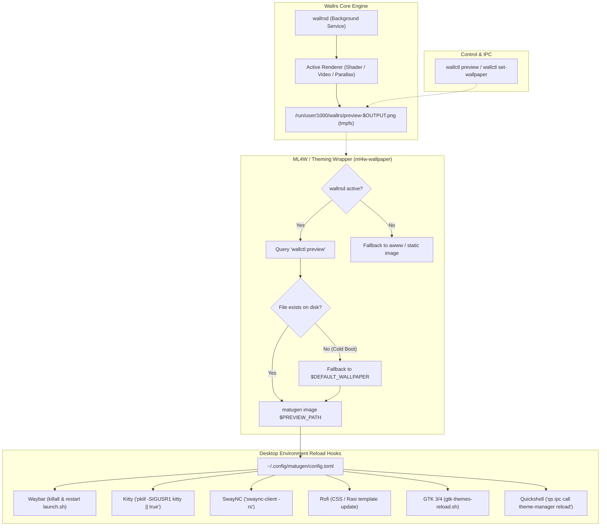

# Hyprland & ML4W Integration: Dynamic Theming and Desktop Environment Research

> **Status**: Preserved Research Archive  
> **Target Environment**: Hyprland (Wayland) + ML4W Dotfiles (Quickshell, Matugen, SwayNC, Waybar)  
> **Related Wallrs Components**: `wallrsd`, `wallctl preview`, `wallrs-theme-sync.path`, systemd user services

---

## 1. Executive Summary & Objective

This document preserves the comprehensive investigation, architectural findings, and script adaptations developed while integrating `wallrs` (live Wayland wallpaper engine) into a modern Hyprland desktop environment configured with the **ML4W** dotfiles suite.

### The Objective
Standard Hyprland setups (such as ML4W) rely on static image daemons (`awww` / `swww`) coupled with [Matugen](https://github.com/InioX/matugen) (Material You color palette generator). Changing a wallpaper triggers an automated pipeline:
1. Extract dominant colors from the wallpaper.
2. Render templates for Kitty, GTK, Waybar, Rofi, and Quickshell.
3. Reload/signal running desktop widgets.

Because `wallrs` renders live, dynamic multi-layer wallpapers (GLSL shaders, video, parallax, day/night cycles) rather than static JPEG/PNG files, it cannot simply pass a static image path to standard utilities. 

This research details how we bridged `wallrs` with the system-wide dynamic theming pipeline, resolved timing and cold-boot edge cases, fixed Quickshell runtime reloads, and eliminated daemon collisions.

---

## 2. Dynamic Theming Architecture & Pipeline



---

## 3. Discovered Issues & Technical Solutions

### Issue 1: Daemon Collision & 30-Second Timeout with `awww`
- **Root Cause**: The upstream `ml4w-wallpaper` script unconditionally called `wait_for_awww()`, which executed an `until awww query` loop for up to 300 iterations (30 seconds). Because `wallrsd` replaces `awww`, the command timed out and crashed with `exit 1` before ever executing `run_matugen` or reloading widgets.
- **Solution**:
  - Implemented `is_wallrs_active()` via `pgrep -x wallrsd`.
  - Guarded `wait_for_awww()` and `set_wallpaper()` to return immediately if `wallrsd` is running or if `--skip-wallpaper` is passed.
  - Implemented `get_wallrs_preview()` to ask `wallctl preview` for the rendered frame path.

### Issue 2: Cold Boot Race Condition (RAM Volatile `tmpfs`)
- **Root Cause**: Wallrs previews are rendered dynamically into `/run/user/<uid>/wallrs/preview-<output>.png` (stored in `tmpfs` in RAM). On a cold reboot or system startup:
  1. The cached wallpaper file (`~/.cache/ml4w/hyprland-dotfiles/current_wallpaper`) still contained the previous session's path in `/run/...`.
  2. Because `/run` is wiped on reboot, the file does not exist until `wallrsd` initializes its first frame.
  3. `ml4w-wallpaper` crashed with `[ERROR] Image file does not exist -> ...` without updating themes.
- **Solution**:
  - In `ml4w-wallpaper`, added safe fallback logic: if `$IMAGE_PATH` is empty OR does not exist on disk, fallback to `$DEFAULT_WALLPAPER` (e.g. `~/.config/ml4w/wallpapers/default.jpg`).
  - Added polling retry logic in `get_wallrs_preview()` (up to 3 seconds) to allow `wallrsd` time to write the initial frame during login.

### Issue 3: Matugen Path Resolution & Terminal Signal Crashes
- **Root Cause 1**: In `~/.config/matugen/config.toml`, template paths were declared as relative (`input_path = "./templates/colors.json"`). Whenever Matugen was invoked from a working directory other than `~/.config/matugen/`, it threw an error and exited without generating colors.
- **Solution 1**: Normalized all template paths to absolute/tilded paths (`"~/.config/matugen/templates/..."`).
- **Root Cause 2**: The post-hook for Kitty terminal (`post_hook = 'pkill -SIGUSR1 kitty'`) returned an error exit code `1` whenever no Kitty terminal was open, failing the entire Matugen run.
- **Solution 2**: Appended `|| true` (`pkill -SIGUSR1 kitty || true`).

### Issue 4: Quickshell Dynamic Theme Loading Failure
- **Root Cause**: In upstream ML4W Quickshell configuration (`~/.config/quickshell/CustomTheme/Theme.qml` and `~/.local/share/ml4w-dotfiles-settings/quickshell/CustomTheme/Theme.qml`):
  ```qml
  // Load the JSON colors automatically when Quickshell starts
  // Component.onCompleted: reloadTheme()
  ```
  The startup trigger was commented out. When Quickshell started, it never executed its `Process` reader to parse `colors.json`, leaving all UI modules (dock, bar, popups) permanently stuck on hardcoded fallback pink (`#ffb4a5`).
- **Solution**:
  - Uncommented `Component.onCompleted: reloadTheme()` in both `Theme.qml` files.
  - Verified Quickshell's dynamic property propagation: dynamic assignments to `root` (`root[key] = newColors[key]`) trigger Qt Quick binding evaluation across all dependent widgets.
  - Added Quickshell IPC post-hook to Matugen's `colorsjson` template:
    ```toml
    post_hook = 'qs ipc call theme-manager reload 2>/dev/null; qs -p "$HOME/.local/share/ml4w-dotfiles-settings/quickshell" ipc call theme-manager reload 2>/dev/null || true'
    ```

### Issue 5: Duplicate SwayNC Notification Daemon
- **Root Cause**: `swaync` was started twice at login:
  1. Once by Hyprland's `~/.config/hypr/conf/autostart.lua` (`hl.exec_cmd("swaync")`).
  2. Once by systemd user service `swaync.service` (`systemctl --user enable swaync`).
  Both processes fought over the D-Bus notification interface, causing missed notifications and high resource churn.
- **Solution**:
  - Disabled the systemd unit (`systemctl --user disable --now swaync.service`), keeping compositor-level process management or vice-versa.

### Issue 6: Systemd User Unit Installation Directory Mismatch
- **Root Cause**: Running `make install` from `wallrs` installed user services into `/usr/local/lib/systemd/user/`. However, standard user target wants (e.g. `~/.config/systemd/user/graphical-session.target.wants/`) were symlinked to `/usr/lib/systemd/user/`, leaving broken symlinks and preventing `wallrsd` from starting automatically at login.
- **Solution**:
  - Re-pointed symlinks to `/usr/local/lib/systemd/user/wallrsd.service`, `wallrs-theme-sync.path`, and `wallrs-auto-pause.service`.

---

## 4. Preserved Reference Configurations

### A. Modified `ml4w-wallpaper` Wrapper Script
Full working implementation of the orchestrator script bridging `wallrs` with ML4W theming:

```bash
#!/usr/bin/env bash

# ============================================================
# Variables
# ============================================================
IMAGE_PATH=""
EFFECT=""
NOTIFICATIONS=false
SKIP_WALLPAPER=false
SKIP_THEMING=false
MONITOR_OUTPUT=""
AWWW_CROP_GRAVITY="center"
CACHE_FOLDER="$HOME/.cache/ml4w/hyprland-dotfiles"
CACHE_FILE="$CACHE_FOLDER/current_wallpaper"
DEFAULT_WALLPAPER="$HOME/.config/ml4w/wallpapers/default.jpg"
BLURRED_WALLPAPER="$CACHE_FOLDER/blurred_wallpaper.png"
SQUARE_WALLPAPER="$CACHE_FOLDER/square_wallpaper.png"
RASI_FILE="$CACHE_FOLDER/current_wallpaper.rasi"
SETTINGS_BLUR="$HOME/.config/ml4w/settings/blur.sh"
SETTINGS_WALLPAPER_FOLDER="$HOME/.config/ml4w/settings/wallpaper-folder"
SETTINGS_WALLPAPER_EFFECT="$HOME/.config/ml4w/settings/wallpaper-effect"
SETTINGS_TRANSITION_EFFECT=$(cat "$HOME/.config/ml4w/settings/wallpaper-transition-effect" 2>/dev/null || echo "fade")
BLUR=$(cat "$SETTINGS_BLUR" 2>/dev/null || echo "0x0")

# ============================================================
# Logging
# ============================================================
RED='\033[0;31m'
GREEN='\033[0;32m'
YELLOW='\033[1;33m'
NC='\033[0m'
info()  { echo -e "${GREEN}[INFO]${NC} $1" >&2; }
warn()  { echo -e "${YELLOW}[WARN]${NC} $1" >&2; }
error() { echo -e "${RED}[ERROR]${NC} $1" >&2; }

# ============================================================
# Functions
# ============================================================

show_help() {
    echo "Usage: ml4w-wallpaper PATH_TO_IMAGE [OPTIONS]"
    echo "  DEFAULT:               $DEFAULT_WALLPAPER"
    echo ""
    echo "Core Parameters:"
    echo "  PATH_TO_IMAGE          Path to the image file to set as wallpaper."
    echo ""
    echo "Optional Parameters:"
    echo "  --effect NAME          Apply a specific wallpaper effect."
    echo "  --random [FOLDER]      Select a random image from FOLDER."
    echo "  --notifications        Enable desktop notifications."
    echo "  --skip-wallpaper       Will skip setting the wallpaper with awww."
    echo "  --skip-theming         Will skip updating OS themes based on new wallpaper."
    echo "  --skip                 Alias for \"--skip-wallpaper\"."
    echo "  --monitor              Specify which input to apply wallpaper change"
    echo "  --crop-gravity         Specify where to anchor wallpaper image"
    echo "  --help                 Show this help message and exit."
}

send_notification() {
    [ "$NOTIFICATIONS" = true ] || return
    notify-send -a "ml4w-wallpaper" -i "preferences-desktop-wallpaper-symbolic" "$1" "$2"
}

is_wallrs_active() {
    pgrep -x wallrsd >/dev/null 2>&1
}

get_wallrs_preview() {
    local wallctl_bin=""
    for bin in wallctl /usr/local/bin/wallctl /usr/bin/wallctl "$HOME/.cargo/bin/wallctl"; do
        if command -v "$bin" &>/dev/null || [[ -x "$bin" ]]; then
            wallctl_bin="$bin"
            break
        fi
    done
    [[ -n "$wallctl_bin" ]] || return 1

    local max_tries=6 count=0
    while (( count < max_tries )); do
        local preview
        preview=$("$wallctl_bin" preview 2>/dev/null || true)
        if [[ -n "$preview" && -f "$preview" ]]; then
            echo "$preview"
            return 0
        fi
        sleep 0.5
        (( count++ ))
    done
    return 1
}

apply_effect() {
    [ -f "$SETTINGS_WALLPAPER_EFFECT" ] || return
    EFFECT=$(cat "$SETTINGS_WALLPAPER_EFFECT")
    [ "$EFFECT" = "off" ] && return
    info "Applying wallpaper effect: $EFFECT"
    local cached="$CACHE_FOLDER/$EFFECT-$(basename "$IMAGE_PATH")"
    [ ! -f "$cached" ] && cp "$IMAGE_PATH" "$cached"
    IMAGE_PATH="$cached"
    source "$HOME/.config/hypr/effects/wallpaper/$EFFECT"
}

wait_for_awww() {
    if [ "$SKIP_WALLPAPER" = true ] || is_wallrs_active; then
        return 0
    fi
    if ! command -v awww &>/dev/null; then
        warn "awww not found, skipping awww-daemon wait"
        return 0
    fi
    local max=300 count=0
    until awww query >/dev/null 2>&1; do
        (( count++ ))
        if (( count >= max )); then
            error "awww-daemon did not start within 30s"
            exit 1
        fi
        sleep 0.1
    done
}

set_wallpaper() {
    local awww_crop_gravity_args
    if [ "$SKIP_WALLPAPER" = true ] || is_wallrs_active; then
        info "Wallpaper set skipped (managed by wallrs or --skip-wallpaper)"
        return
    fi
    if ! command -v awww &>/dev/null; then
        warn "awww not found, cannot set wallpaper via awww"
        return 1
    fi
    read AWWW_MINOR AWWW_PATCH <<< $(awww --version | awk -F. '{print $2 " " $3}')
    (( $AWWW_MINOR > 12 || $AWWW_MINOR == 12 && $AWWW_PATCH > 0 )) \
        && awww_crop_gravity_args="--resize crop --crop-gravity $AWWW_CROP_GRAVITY" \
        || awww_crop_gravity_args=""
    info "Setting wallpaper: $IMAGE_PATH${MONITOR_OUTPUT:+ on monitor $MONITOR_OUTPUT}"
    local max=30 count=0
    until awww img "$IMAGE_PATH" ${MONITOR_OUTPUT:+-o $MONITOR_OUTPUT} $awww_crop_gravity_args --transition-type "$SETTINGS_TRANSITION_EFFECT" 2>/dev/null; do
        (( count++ ))
        if (( count >= max )); then
            error "Failed to set wallpaper after ${max}s (no valid outputs)"
            return 1
        fi
        sleep 1
    done
}

run_matugen() {
    local theme_pref
    theme_pref=$(grep -E '^gtk-application-prefer-dark-theme=' "$HOME/.config/gtk-3.0/settings.ini" 2>/dev/null | awk -F'=' '{print $2}')
    
    local mode="light"
    case "$theme_pref" in
        1|true) mode="dark" ;;
    esac

    local bin="matugen"
    [ -f "$HOME/.cargo/bin/matugen" ] && bin="$HOME/.cargo/bin/matugen"
    [ -f "$HOME/.local/bin/matugen" ] && bin="$HOME/.local/bin/matugen"

    info "Running matugen in $mode mode"
    "$bin" image "$IMAGE_PATH" --source-color-index 0 -m "$mode"
    info "Matugen updated"
}

reload_waybar() {
    if pgrep -x waybar >/dev/null; then
        info "Waybar is currently running."
        killall waybar || true
        sleep 0.5
    else
        info "Waybar not running"
    fi
    nohup bash -c "$HOME/.config/waybar/launch.sh" > /dev/null 2>&1 &
    disown
    info "Waybar restarted"
}

reload_quickshell() {
    if pgrep -x qs >/dev/null; then
        qs ipc call theme-manager reload
        qs -p "$HOME/.local/share/ml4w-dotfiles-settings/quickshell" ipc call theme-manager reload
        info "Quickshell theme updated"
    else
        warn "Quickshell not running, skipping theme reload"
    fi
}

reload_pywalfox() {
    type pywalfox >/dev/null 2>&1 || return
    pywalfox update
    info "Pywalfox updated"
}

reload_swaync() {
    sleep 0.1
    swaync-client -rs
    info "SwayNC refreshed"
}

generate_image_variants() {
    command -v magick >/dev/null 2>&1 || return
    magick "$IMAGE_PATH" -resize 75% "$BLURRED_WALLPAPER"
    if [ "$BLUR" != "0x0" ]; then
        magick "$BLURRED_WALLPAPER" -blur "$BLUR" "$BLURRED_WALLPAPER"
    fi
    info "Blurred wallpaper created"
    magick "$IMAGE_PATH" -gravity Center -extent 1:1 "$SQUARE_WALLPAPER"
    info "Square wallpaper created"
    echo "* { current-image: url(\"$BLURRED_WALLPAPER\", height); }" > "$RASI_FILE"
    info "Rasi file updated"
}

# ============================================================
# Parameter Parsing
# ============================================================
[[ $# -eq 0 ]] && { show_help; exit 1; }

while [[ $# -gt 0 ]]; do
    case "$1" in
        --skip|--skip-wallpaper)
            SKIP_WALLPAPER=true; shift ;;
        --skip-theming)
            SKIP_THEMING=true; shift ;;
        --effect)
            EFFECT="$2"; shift 2 ;;
        --random)
            if [[ -n "$2" && "$2" != -* ]]; then
                RANDOM_FOLDER="$2"; shift 2
            else
                RAW_FOLDER=$(cat "$SETTINGS_WALLPAPER_FOLDER" 2>/dev/null)
                RANDOM_FOLDER="${RAW_FOLDER//\$HOME/$HOME}"
                RANDOM_FOLDER="${RANDOM_FOLDER//\~/$HOME}"
                shift 1
            fi
            if [[ ! -d "$RANDOM_FOLDER" ]]; then
                error "Directory does not exist -> $RANDOM_FOLDER"; exit 1
            fi
            IMAGE_PATH=$(find "$RANDOM_FOLDER" -maxdepth 1 -type f \
                \( -iname "*.jpg" -o -iname "*.jpeg" -o -iname "*.png" \) | shuf -n 1)
            [[ -z "$IMAGE_PATH" ]] && { error "No valid images found in -> $RANDOM_FOLDER"; exit 1; }
            info "Random wallpaper selected: $IMAGE_PATH" ;;
        --notifications)
            NOTIFICATIONS=true; shift ;;
        --monitor)
            MONITOR_OUTPUT="$2"; shift 2 ;;
        --crop-gravity)
            AWWW_CROP_GRAVITY="$2"; shift 2 ;;
        --help)
            show_help; exit 0 ;;
        -*)
            error "Unknown option: $1"; show_help; exit 1 ;;
        *)
            if [[ -z "$IMAGE_PATH" ]]; then
                IMAGE_PATH="$1"
            else
                error "Multiple image paths provided -> $1"; exit 1
            fi
            shift ;;
    esac
done

# ============================================================
# Validation & Wallrs Integration
# ============================================================
if is_wallrs_active; then
    # If a manifest or directory with wallpaper.toml was provided, set it via wallctl
    if [[ -n "$IMAGE_PATH" ]] && { [[ -d "$IMAGE_PATH" && -f "$IMAGE_PATH/wallpaper.toml" ]] || [[ "$IMAGE_PATH" == *.toml ]]; }; then
        info "Setting wallrs wallpaper: $IMAGE_PATH"
        wallctl set-wallpaper "$IMAGE_PATH" || warn "wallctl set-wallpaper failed"
        SKIP_WALLPAPER=true
    fi

    # If no image path provided, or --skip-wallpaper passed, or file doesn't exist, query preview from wallrs
    if [[ -z "$IMAGE_PATH" || "$SKIP_WALLPAPER" = true || ! -f "$IMAGE_PATH" ]]; then
        local_preview=$(get_wallrs_preview)
        if [[ -n "$local_preview" && -f "$local_preview" ]]; then
            info "Retrieved active wallpaper preview from wallrs -> $local_preview"
            IMAGE_PATH="$local_preview"
            SKIP_WALLPAPER=true
        fi
    fi
fi

if [[ -z "$IMAGE_PATH" || ! -f "$IMAGE_PATH" ]]; then
    info "Using default wallpaper -> $DEFAULT_WALLPAPER"
    IMAGE_PATH="$DEFAULT_WALLPAPER"
fi

if [[ ! -f "$IMAGE_PATH" ]]; then
    error "Image file does not exist -> $IMAGE_PATH"; exit 1
fi

mkdir -p "$CACHE_FOLDER"
echo "$IMAGE_PATH" > "$CACHE_FILE"
info "Cache updated: $IMAGE_PATH"

# ============================================================
# Main Execution
# ============================================================
if [ "$SKIP_WALLPAPER" = true ] || is_wallrs_active; then
    info "Skipping awww (managed by wallrs or --skip-wallpaper)"
else
    apply_effect
    wait_for_awww
    set_wallpaper
fi

if "$SKIP_THEMING"; then
    info "Updating theming skipped"
else
    run_matugen
    reload_waybar
    reload_quickshell
    reload_pywalfox
    reload_swaync
    generate_image_variants
fi

send_notification "Wallpaper Updated" "$(basename "$IMAGE_PATH")${MONITOR_OUTPUT:+ on output $MONITOR_OUTPUT}"
info "Done"
```

---

### B. Matugen Configuration (`~/.config/matugen/config.toml`)
Optimized for robust multi-directory execution and Quickshell IPC triggers:

```toml
[config]

[templates.colorsjson]
input_path = '~/.config/matugen/templates/colors.json'
output_path = '~/.config/ml4w/colors/colors.json'
post_hook = 'qs ipc call theme-manager reload 2>/dev/null; qs -p "$HOME/.local/share/ml4w-dotfiles-settings/quickshell" ipc call theme-manager reload 2>/dev/null || true'

[templates.kitty]
input_path = '~/.config/matugen/templates/kitty-colors.conf'
output_path = '~/.config/kitty/colors-matugen.conf'
post_hook = 'pkill -SIGUSR1 kitty || true'

[templates.btop]
input_path = '~/.config/matugen/templates/btop.theme'
output_path = '~/.config/btop/themes/matugen.theme'

[templates.hyprland]
input_path = '~/.config/matugen/templates/hyprland-colors.conf'
output_path = '~/.config/hypr/colors.conf'
post_hook = 'hyprctl reload'

[templates.hyprland-lua]
input_path = '~/.config/matugen/templates/hyprland-colors.lua'
output_path = '~/.config/hypr/colors.lua'
post_hook = 'hyprctl reload'

[templates.waybar]
input_path = '~/.config/matugen/templates/colors.css'
output_path = '~/.config/waybar/colors.css'

[templates.rofi]
input_path = '~/.config/matugen/templates/rofi-colors.rasi'
output_path = '~/.config/rofi/colors.rasi'

[templates.gtk3]
input_path = '~/.config/matugen/templates/gtk-colors.css'
output_path = '~/.config/gtk-3.0/colors.css'

[templates.gtk4]
input_path = '~/.config/matugen/templates/gtk-colors.css'
output_path = '~/.config/gtk-4.0/colors.css'
post_hook = '~/.config/matugen/post-hook-scripts/gtk-themes-reload.sh'

[templates.pywalfox]
input_path = '~/.config/matugen/templates/pywalfox-colors.json'
output_path = '~/.cache/wal/colors.json'

[templates.swaync]
input_path = '~/.config/matugen/templates/colors.css'
output_path = '~/.config/swaync/colors.css'

[templates.sequences]
input_path = '~/.config/matugen/templates/sequences'
output_path = '~/.cache/wal/sequences'

[templates.primary]
input_path = '~/.config/matugen/templates/primary'
output_path = '~/.config/ml4w/colors/primary'

[templates.secondary]
input_path = '~/.config/matugen/templates/secondary'
output_path = '~/.config/ml4w/colors/secondary'

[templates.on_surface]
input_path = '~/.config/matugen/templates/onsurface'
output_path = '~/.config/ml4w/colors/onsurface'

[templates.on_primary]
input_path = '~/.config/matugen/templates/onprimary'
output_path = '~/.config/ml4w/colors/onprimary'

[templates.ml4w_dotfiles_settings]
input_path = "~/.config/matugen/templates/colors.json"
output_path = "~/.local/share/ml4w-dotfiles-settings/colors/colors.json"

[templates.quickshell_overview]
input_path = "~/.config/matugen/templates/quickshell-overview.qml"
output_path = "~/.config/quickshell/overview/common/Appearance.colors.qml"

[templates.ohmyposh]
input_path = '~/.config/matugen/templates/ohmyposh-colors.json'
output_path = '~/.config/ohmyposh/colors.json'
post_hook = "jq --slurpfile palette ~/.config/ohmyposh/colors.json '. + $palette[0]' ~/.config/ohmyposh/EDM115-newline.omp.json > /tmp/new_theme.json && mv /tmp/new_theme.json ~/.config/ohmyposh/EDM115-newline.omp.json"
```

---

### C. Quickshell Theme Singleton (`Theme.qml`)
Located in `~/.config/quickshell/CustomTheme/Theme.qml` and `~/.local/share/ml4w-dotfiles-settings/quickshell/CustomTheme/Theme.qml`:

```qml
pragma Singleton
import QtQuick
import Quickshell 
import Quickshell.Io 

QtObject { 
    id: root
    
    // Static properties
    readonly property string fontFamily: "Fira Sans Semibold"
    
    // Dynamic color properties
    property color background: "#1a1110"
    property color error: "#ffb4ab"
    property color error_container: "#93000a"
    property color inverse_on_surface: "#392e2c"
    property color inverse_primary: "#904b3d"
    property color inverse_surface: "#f1dfdb"
    property color on_background: "#f1dfdb"
    property color on_error: "#690005"
    property color on_error_container: "#ffdad6"
    property color on_primary: "#561f13"
    property color on_primary_container: "#ffdad3"
    property color on_primary_fixed: "#3a0a03"
    property color on_primary_fixed_variant: "#733427"
    property color on_secondary: "#442a24"
    property color on_secondary_container: "#ffdad3"
    property color on_secondary_fixed: "#2c1510"
    property color on_secondary_fixed_variant: "#5d3f39"
    property color on_surface: "#f1dfdb"
    property color on_surface_variant: "#d8c2bd"
    property color on_tertiary: "#3d2f04"
    property color on_tertiary_container: "#f9e0a6"
    property color on_tertiary_fixed: "#241a00"
    property color on_tertiary_fixed_variant: "#554519"
    property color outline: "#a08c88"
    property color outline_variant: "#534340"
    property color primary: "#ffb4a5"
    property color primary_container: "#733427"
    property color primary_fixed: "#ffdad3"
    property color primary_fixed_dim: "#ffb4a5"
    property color scrim: "#000000"
    property color secondary: "#e7bdb4"
    property color secondary_container: "#5d3f39"
    property color secondary_fixed: "#ffdad3"
    property color secondary_fixed_dim: "#e7bdb4"
    property color shadow: "#000000"
    property color source_color: "#fc2f04"
    property color surface: "#1a1110"
    property color surface_bright: "#423734"
    property color surface_container: "#271d1b"
    property color surface_container_high: "#322826"
    property color surface_container_highest: "#3d3230"
    property color surface_container_low: "#231917"
    property color surface_container_lowest: "#140c0a"
    property color surface_dim: "#1a1110"
    property color surface_tint: "#ffb4a5"
    property color surface_variant: "#534340"
    property color tertiary: "#dcc48c"
    property color tertiary_container: "#554519"
    property color tertiary_fixed: "#f9e0a6"
    property color tertiary_fixed_dim: "#dcc48c"

    property var themeReader: Process {
        id: reader
        command: ["cat", Quickshell.env("HOME") + "/.config/ml4w/colors/colors.json"]
        
        // REQUIRED: Quickshell parses the binary stream into text
        stdout: StdioCollector {
            onStreamFinished: {
                var output = this.text.trim();
                if (output !== "") {
                    try {
                        var newColors = JSON.parse(output);
                        for (var key in newColors) {
                            if (root.hasOwnProperty(key) && key !== "objectName") {
                                root[key] = newColors[key];
                            }
                        }
                        console.warn("Theme colors loaded successfully! primary: " + root.primary);
                    } catch (e) {
                        console.warn("Failed to parse theme JSON: " + e);
                    }
                }
            }
        }
    }

    function reloadTheme() {
        console.warn("Theme.reloadTheme() called!");
        reader.running = false;
        reader.running = true;
    }

    // Critical fix: Ensure reload is triggered on startup
    Component.onCompleted: reloadTheme()
}
```

---

## 5. Architectural Blueprint for Wallrs Native Theming

Based on the research above, rather than relying on external wrapper scripts like `ml4w-wallpaper`, a standalone or native `wallrs` integration should ideally follow these principles:

1. **Native IPC Event Stream**:
   - `wallrsd` emits an IPC notification or D-Bus signal on wallpaper changes:
     `{"event": "wallpaper_changed", "output": "eDP-1", "preview_path": "/run/user/1000/wallrs/preview-eDP-1.png"}`
2. **Persistent vs Volatile Storage**:
   - For environments that run cold boot theming before GUI initialization, `wallrs` could optionally mirror the last rendered preview frame into persistent cache (`~/.cache/wallrs/last-preview.png`).
3. **Generic Post-Execution Hooks**:
   - Allow users to define a hook in `~/.config/wallrs/config.toml`:
     ```toml
     [hooks]
     on_wallpaper_change = "matugen image \"$WALLRS_PREVIEW\""
     ```
   This eliminates external glue scripts and enables plug-and-play dynamic theming across any Wayland desktop (Hyprland, Sway, River, Niri).
