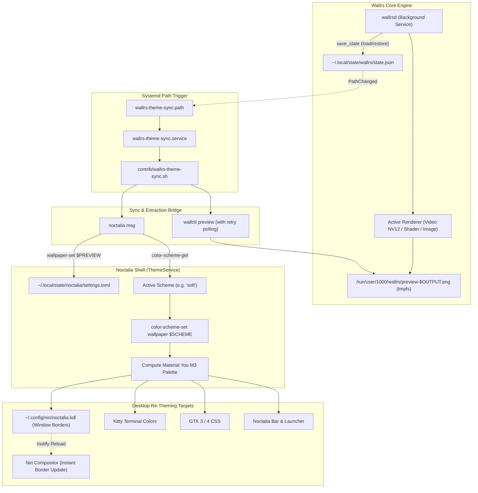

# Niri & Noctalia Integration: Dynamic Theming and Compositor Optimization Research

> **Status**: Preserved Technical Research & Reference  
> **Target Environment**: Niri (Scrollable-Tiling Wayland Compositor) + Noctalia Shell (Rust-based Material You Desktop Suite)  
> **Related Wallrs Components**: `wallrsd`, `wallctl preview`, `wallrs-theme-sync.path`, `wallrs-theme-sync.sh`, `niri-auto-pause.sh`

---

## 1. Executive Summary & Objective

This document preserves the comprehensive investigation, architectural findings, and script integrations developed to seamlessly unite **`wallrs`** (live GPU/Wayland wallpaper daemon) with the **Niri** compositor and the **Noctalia** desktop shell.

### The Objective
Standard desktop setups pairing Niri and Noctalia use Noctalia's built-in background image service, which generates Material You color schemes and renders templates across the system:
1. Noctalia extracts dominant tonal colors from a static wallpaper image.
2. Noctalia re-computes an M3 palette (e.g., `soft` / Ensalada de Frutas, `tonal-spot`, `vibrant`).
3. Templates are compiled and applied to:
   - **Niri**: Window borders and focus rings via `~/.config/niri/noctalia.kdl`.
   - **Terminals**: Kitty colors in real time.
   - **Applications**: GTK3/4, Starship prompt, VSCode, Fastfetch, Pywalfox.

Because `wallrs` renders dynamic wallpapers (GLSL shaders, looping GStreamer video, mouse-reactive parallax) directly onto Wayland layer-shell surfaces (`zwlr_layer_shell_v1`), integrating it required solving:
* **Layer Shell Collisions**: Noctalia's native wallpaper daemon drawing over or under `wallrs`.
* **Dynamic Color Extraction**: Extracting accurate color palettes from real-time animated video/shader frames rather than static files.
* **Auto-Pause Efficiency**: Suspending GPU rendering when Niri workspaces are covered by opaque windows, while remaining active on transparent terminals (Kitty) or when Niri overview is opened.
* **Timing & Session Restore**: Triggering automatic theme synchronization on boot/login when restoring previously active wallpapers without race conditions.

---

## 2. Architecture & Theming Pipeline



---

## 3. Resolving the Noctalia Layer Collision

By default, Noctalia launches its own wallpaper layer on the Wayland background. If left enabled, Noctalia will either:
1. Cover `wallrs` completely with its own static image, or
2. Conflict for layer-shell exclusivity and z-order.

### The Fix
To delegate all wallpaper rendering exclusively to `wallrs`, Noctalia's internal wallpaper renderer must be disabled in its state configuration:

**File**: `~/.local/state/noctalia/settings.toml`
```toml
[wallpaper]
enabled = false
```

When `[wallpaper] enabled = false`:
* Noctalia stops requesting layer-shell wallpaper surfaces.
* Noctalia's `ThemeService` **remains 100% functional**, continuing to compute palettes from whatever path is provided via `wallpaper-set`.
* If Noctalia had already mapped a surface prior to editing the configuration, a one-time restart releases the surface:
  ```bash
  killall noctalia && noctalia &
  ```

---

## 4. Niri Auto-Pause Driver (`niri-auto-pause.sh`)

In Niri's scrollable-tiling paradigm, workspaces scroll horizontally. To maximize battery life and eliminate GPU load when windows cover the display:

### Compositor Event Stream
Niri exposes a high-performance JSON IPC stream:
```bash
niri msg --json event-stream
```

### Event Handling Logic:
1. **Workspace Transitions (`WorkspaceActivated`)**:
   Tracks the focused workspace ID and inspects open windows on that workspace.
2. **Window Focus & Mode Changes (`WindowFocusChanged`, `OverviewToggled`)**:
   * **Empty Workspace**: `wallctl resume` (renders live wallpaper).
   * **Transparent Windows**: If focused window has transparency (e.g., Kitty with opacity < 1.0), `wallctl resume`.
   * **Opaque Fullscreen/Maximized Windows**: `wallctl pause` (suspends Wayland frame callbacks; GPU drops to 0.0%).
   * **Niri Overview Mode**: Opening Niri's overview immediately unpauses `wallrsd` so the wallpaper animates smoothly behind the window thumbnails.

The service is managed automatically by `wallrs-auto-pause.service`, which identifies Niri via `$NIRI_SOCKET` and `$XDG_CURRENT_DESKTOP`.

---

## 5. Live Color Extraction & The Video Preroll Bug

### The Blank Frame Mystery
During initial integration with video wallpapers (`.mp4`), testing revealed that manually setting a screenshot produced warm brown/pink tones, while automated sync produced an unnatural deep cyan/blue palette.

Investigation with `file` and image viewers revealed that `wallctl preview` was generating an entirely blank / transparent PNG (`0x00000000` pixels). Noctalia extracted colors from a black canvas, falling back to default cyan tones.

### Root Cause
When a video wallpaper is loaded or paused, GStreamer's `playbin` pipeline transitions to `Paused` or `Playing`. The `appsink` element buffers frames asynchronously. If `wallctl preview` immediately executed `Command::Screenshot`, `try_pull_sample(ClockTime::ZERO)` returned `None` because the hardware decoder had not yet pushed the first frame. `VideoRenderer` fell back to its clear pass, rendering blank pixels.

### The Solution: Decoder Preroll Wait
In [`crates/wallrs-content-video/src/lib.rs`](file:///home/asdromundo/Documentos/wallrs/crates/wallrs-content-video/src/lib.rs):
```rust
let pull_timeout = if self.texture_y.is_none() {
    // First frame initialization or paused preroll: wait briefly (up to 500ms)
    // for the decoder to produce the first frame so initial presentation
    // and screenshot capture don't render a blank/black frame.
    gst::ClockTime::from_mseconds(500)
} else {
    gst::ClockTime::ZERO
};

let sample_opt = appsink
    .try_pull_sample(pull_timeout)
    .or_else(|| appsink.try_pull_preroll(pull_timeout));
```
With this wait in place, the first video frame is always decoded and uploaded to NV12 textures before `Command::Screenshot` reads back the pixel buffer, guaranteeing rich, representative color extraction.

---

## 6. Noctalia IPC Protocol Mechanics

Noctalia's CLI exposes IPC commands via `noctalia msg`. Understanding the exact sequence is vital to avoid palette reversion:

### 1. `wallpaper-set <path>`
```bash
noctalia msg wallpaper-set "$preview_path"
```
* Stores the new wallpaper file in `settings.toml` under `[wallpaper.default]` and `[wallpaper.monitors.<output>]`.
* Does *not* recompute the in-memory palette immediately.

### 2. `color-scheme-get`
```bash
current_scheme="$(noctalia msg color-scheme-get)"
# Returns: "wallpaper soft" or "wallpaper tonal-spot"
scheme="$(echo "$current_scheme" | awk '{print $2}')"
```
* Queries the user's active tonal configuration.
* In Noctalia, schemes correspond to M3 algorithms:
  - `soft`: "Ensalada de Frutas" (Fruit Salad - balanced saturation and tone).
  - `tonal-spot`: Standard Material You default.
  - `content`: Closely matches dominant image colors.
  - `vibrant`: High-chroma punchy accents.

### 3. `color-scheme-set wallpaper <scheme>`
```bash
noctalia msg color-scheme-set wallpaper "$scheme"
```
* **Critical Step**: Triggers Noctalia's `ThemeService` to re-extract colors from the newly set wallpaper path using the chosen scheme.
* Recomputes the palette in memory and applies all configured templates (`gtk3`, `gtk4`, `kitty`, `niri`, `starship`).
* Updates `~/.config/niri/noctalia.kdl`. Niri detects the file modification and re-colors window borders in real time without flickering.

---

## 7. Startup Theme Synchronization & Inotify Race Prevention

To ensure that rebooting or logging in with a previously saved wallpaper automatically restores the desktop theme:

1. **State Re-Saving on Restore**:
   When `wallrsd` boots with `--restore` (default), `try_restore_output_state` in [`crates/wallrs-core/src/engine.rs`](file:///home/asdromundo/Documentos/wallrs/crates/wallrs-core/src/engine.rs) loads the wallpaper and calls:
   ```rust
   let _ = crate::state::save_state(&self.state_path, &self.state_snapshot);
   ```
2. **Systemd Path Trigger**:
   [`wallrs-theme-sync.path`](file:///home/asdromundo/Documentos/wallrs/extra/systemd/wallrs-theme-sync.path) watches `~/.local/state/wallrs/state.json` via `PathChanged=`. The rewrite triggers `wallrs-theme-sync.service`.
3. **Retry Polling in `get_preview_path()`**:
   During daemon cold-boot, `wallctl preview` may be invoked before the WGPU surface configuration and video pipeline have completed their initial draw. `get_preview_path()` loops up to 15 times with 200ms sleep (3-second window) until a non-empty preview image exists on disk:
   ```bash
   get_preview_path() {
       local attempts=15
       local img=""
       while [[ $attempts -gt 0 ]]; do
           if img="$("$WALLCTL" preview "$@" 2>/dev/null)" && [[ -n "$img" && -f "$img" ]]; then
               echo "$img"
               return 0
           fi
           attempts=$((attempts - 1))
           sleep 0.2
       done
       "$WALLCTL" preview "$@"
   }
   ```

---

## 8. Troubleshooting Reference for Future Maintenance

| Symptom | Cause | Resolution |
| :--- | :--- | :--- |
| **Window borders revert to previous color after change** | Only `wallpaper-set` was called; Noctalia kept old in-memory palette | Ensure `noctalia msg color-scheme-set wallpaper <scheme>` is called immediately after `wallpaper-set`. |
| **Palette generates deep cyan / dark blue on video wallpaper** | Video appsink returned empty sample before first frame decoded | Verify video preroll timeout in `VideoRenderer::update()` is active (at least 500ms). |
| **Wallpaper is obscured or invisible under Noctalia** | Noctalia's built-in wallpaper layer is enabled | Verify `[wallpaper] enabled = false` in `~/.local/state/noctalia/settings.toml` and restart Noctalia. |
| **`wallrs-theme-sync.service` does not run on startup** | State file was not updated on restore | Confirm `try_restore_output_state` calls `save_state` upon successful output configuration. |
| **Niri borders do not update dynamically** | `~/.config/niri/config.kdl` is missing include | Ensure `include "noctalia.kdl"` is present in Niri configuration. |
